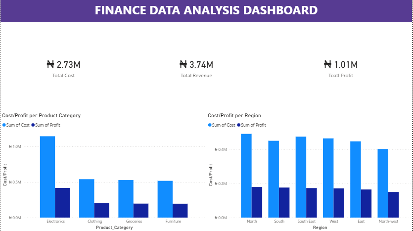

# 📊 From Raw to Insights: Financial Performance Analysis

> **Transforming unstructured transactional data into actionable business intelligence using Excel & Power BI.**

## 🎯 Project Overview

In many organizations, financial data is trapped in messy, inconsistent spreadsheets. This project demonstrates the end-to-end process of taking **unstructured financial records**, cleaning them for accuracy, and building an **interactive Power BI dashboard** that reveals the "story" behind the numbers.

**The Goal:** Provide stakeholders with a clear view of profitability, regional performance, and payment trends to drive data-backed growth and decisions.

-----

## 🚀 The Business Problem

The raw dataset was plagued by:

  * **Inconsistent Formats:** Mixed date types and currency symbols preventing calculations.
  * **Data Fragmentation:** No clear link between costs, revenue, and regional performance.
  * **Visual Noise:** Difficulty in identifying which products or regions were actually profitable versus just high-volume.

-----

## 🛠️ Tech Stack & Skills

  * **Microsoft Excel:** Advanced data cleaning, standardization, and initial auditing.
  * **Power BI (Power Query):** ETL (Extract, Transform, Load), Data Modeling, and DAX for custom measures.
  * **Data Visualization:** Designing intuitive, user-centric dashboards.

-----

## 🔄 The Data Journey (Process)

### 1\. The Clean-Up (Excel)

Before analysis, I performed a deep-clean to ensure "one version of the truth":

  * Standardized dates and removed non-numeric currency symbols.
  * Used `TRIM` and `PROPER` functions to fix inconsistent naming (e.g., "NorthWest" vs "North-West").
  * Validated 1,500+ transactions for integrity.

### 2\. Transformation & Modeling (Power BI)

  * Imported cleaned data into Power BI via Power Query.
  * Structured a star-schema-ready model for seamless filtering.

-----

## 📈 Executive Insights

After processing **₦3.74M in Revenue**, the following business insights were uncovered:

  * **Product Powerhouses:** **Electronics** is the primary driver of revenue, though it carries the highest operational cost.
  * **Regional Efficiency:** The **North** region leads in transaction volume, while the **North-West** represents a significant growth opportunity due to current under-penetration.
  * **Payment Preferences:** **Card payments** dominate the ecosystem, suggesting a tech-savvy customer base, while **Bank Transfers** remain an underutilized channel.
  * **Margin Health:** Despite fluctuations, the business maintains a healthy **27% average profit margin**, though a dip in 2024 performance requires immediate strategic attention.

-----

## 🖥️ The Final Dashboard

The interactive dashboard allows users to slice data by Year, Region, and Category.

> *
* Interactive Dashboard showing revenue and profit across all dimension.

-----

## 💡 Strategic Recommendations

1.  **Optimize Payments:** Implement a 1–2% incentive for **Bank Transfers** to reduce card processing fees and boost net margins.
2.  **Product Diversification:** Investigate why **Groceries and Clothing** have low margins and trial a "bundle" strategy with high-margin Electronics.
3.  **Retention:** With only **8 core customers** driving 1,500 transactions, a "VIP Loyalty Program" is critical to mitigate the risk of high-volume client churn.

-----

## 📂 Project Files

  * [Cleaned Dataset (Excel)](https://github.com/Osi-Chidera-John/From-Raw-to-Insights-Financial-Performance-Analysis/blob/main/finance_dataset.xlsx)
  * [Interactive Power BI File (.pbix)](https://github.com/Osi-Chidera-John/From-Raw-to-Insights-Financial-Performance-Analysis/blob/main/financedata_dashboard.pbix)
-----

## 👤 Contact 

I am a Data Analyst dedicated to turning messy data into business gold.

  * **LinkedIn:** (https://www.linkedin.com/in/john-chidera-osi-0b6b55319/)
  * **Email:** chiderajohn519@gmail.com

