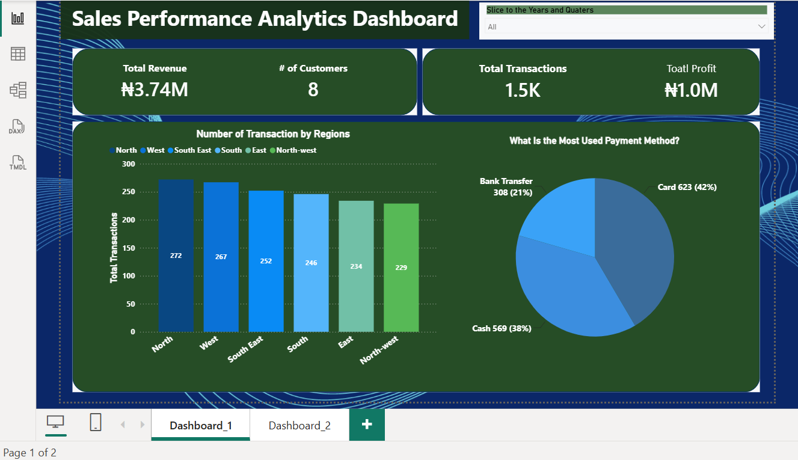
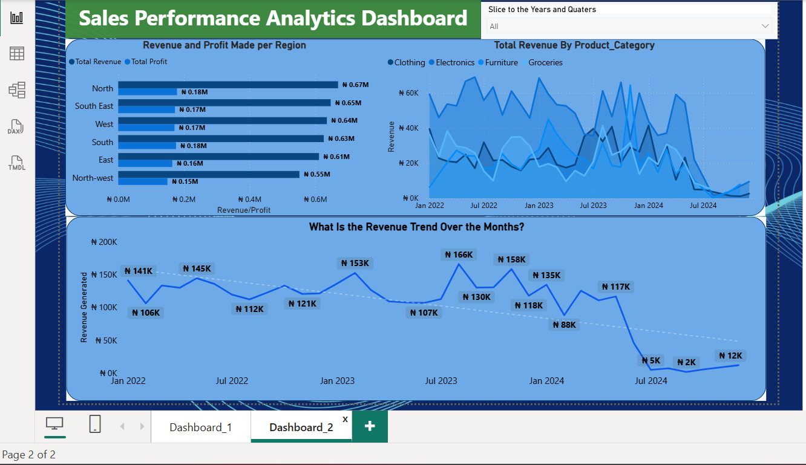

# 📊 From Raw to Insights: Financial Performance Analysis

## Introduction

 Businesses generate vast amounts of sales data daily, but transforming that data into actionable insights is what drives informed decision-making. This project presents a comprehensive **Sales Performance Analytics Dashboard** developed in **Power BI** to analyze revenue generation, profitability, customer activity, regional performance, product category trends, and payment preferences. 

The dashboard enables stakeholders to monitor key business metrics, identify growth opportunities, uncover performance gaps, and make strategic decisions backed by data.

---

## Background

Understanding sales performance is critical for sustaining growth and maintaining competitiveness. Organizations need visibility into how different regions, products, and customer behaviors contribute to overall business outcomes.

This project was designed to answer key business questions:

* How much revenue and profit has the business generated?
* Which regions contribute most to revenue and transactions?
* What payment methods do customers prefer?
* Which product categories drive revenue growth?
* How has revenue changed over time?
* What areas require strategic improvement?

The dashboard transforms raw sales transaction data into an intuitive reporting solution that supports data-driven decision-making.

---

## Data Source

The dataset used for this project was sourced from **Kaggle** and contains historical sales transaction records spanning multiple regions, product categories, customers, and payment methods.

### Dataset Features

The dataset includes:

* Transaction Date
* Region
* Customer Information
* Product Category
* Revenue
* Profit
* Payment Method
* Transaction Records
* Sales Performance Metrics

Prior to analysis, the data underwent extensive cleaning, transformation, and validation to ensure accuracy and consistency.

**Source:** Kaggle Sales Dataset

---

# Tools & Technologies Used

| Tool        | Purpose                               |
| ----------- | ------------------------------------- |
| Power BI    | Dashboard Development & Visualization |
| Power Query | Data Cleaning & Transformation        |
| DAX         | KPI Calculations & Business Metrics   |

---

# Dashboard 1: Executive Sales Overview

## Dashboard Preview

> ****

---

## Business Performance KPIs

### Total Revenue

**₦3.74 Million**

The business generated approximately **₦3.74M** in revenue across the reporting period, demonstrating strong overall sales performance.

### Total Profit

**₦1.0 Million**

Profitability remained healthy, with approximately **₦1M** generated from total sales activities.

### Total Transactions

**1.5K Transactions**

The company recorded approximately **1,500 sales transactions**, indicating active customer engagement and purchasing behavior.

### Number of Customers

**8 Customers**

The dataset contains transactions from eight unique customers.

---

## Regional Transaction Analysis

### Number of Transactions by Region

| Region     | Transactions |
| ---------- | ------------ |
| North      | 272          |
| West       | 267          |
| South East | 252          |
| South      | 246          |
| East       | 234          |
| North-West | 229          |

### Key Insights

#### North Leads Transaction Activity

The North region recorded the highest number of transactions, contributing approximately **18% of all sales transactions**.

#### Balanced Regional Distribution

Transaction volume remains relatively balanced across all regions, indicating broad market penetration and reduced dependence on a single location.

#### North-West Underperforms

North-West generated the lowest transaction volume, suggesting potential opportunities for customer acquisition and market expansion.

### Business Impact

A balanced transaction distribution reduces business risk and creates a more stable revenue structure.

---

## Payment Method Analysis

### Most Used Payment Methods

| Payment Method | Transactions | Percentage |
| -------------- | ------------ | ---------- |
| Card           | 623          | 42%        |
| Cash           | 569          | 38%        |
| Bank Transfer  | 308          | 21%        |

### Key Insights

#### Card Payments Dominate

Customers show a strong preference for card payments, accounting for the largest share of transactions.

#### Cash Remains Significant

Despite digital adoption, cash continues to represent a substantial portion of customer purchases.

#### Lower Transfer Adoption

Bank transfers remain the least preferred payment option.

### Business Impact

Improving digital payment infrastructure and incentivizing cashless transactions may enhance customer convenience and operational efficiency.

---

## Dashboard 1 Summary

The Executive Dashboard provides a high-level overview of business performance. The analysis reveals strong revenue generation, healthy profitability, balanced regional participation, and a clear customer preference for card-based payments.

---

# Dashboard 2: Revenue, Profit & Trend Analysis

## Dashboard Preview

> ****

---

## Revenue and Profit by Region

### Revenue Performance

| Region     | Revenue |
| ---------- | ------- |
| North      | ₦669K   |
| South East | ₦647K   |
| West       | ₦635K   |
| South      | ₦626K   |
| East       | ₦611K   |
| North-West | ₦552K   |

### Profit Performance

| Region     | Profit |
| ---------- | ------ |
| North      | ₦179K  |
| South      | ₦176K  |
| South East | ₦173K  |
| West       | ₦171K  |
| East       | ₦165K  |
| North-West | ₦150K  |

### Key Insights

#### North is the Strongest Market

North generated both the highest revenue and profit, making it the organization's most valuable region.

#### Consistent Profitability

Profit distribution closely follows revenue performance, suggesting stable profit margins across regions.

#### North-West Requires Attention

North-West recorded the lowest revenue and profit figures, indicating room for market development and strategic intervention.

### Business Impact

The North region should be prioritized for retention and growth initiatives, while North-West may require targeted marketing and sales efforts.

---

## Revenue by Product Category

### Categories Analyzed

* Clothing
* Electronics
* Furniture
* Groceries
* 

### Key Insights

#### Electronics Drives Revenue Peaks

Electronics consistently generates the highest revenue spikes throughout the reporting period, indicating strong customer demand.

#### Clothing Maintains Stable Performance

Clothing contributes consistently over time and serves as a reliable revenue source.

#### Furniture and Groceries Show Fluctuation

These categories demonstrate more variable performance, potentially influenced by seasonality and customer purchasing behavior.

#### Revenue Volatility Across Categories

The category trends reveal shifting customer preferences and changing demand patterns over time.

### Business Impact

Understanding category-level performance helps optimize inventory planning, marketing campaigns, and product investment strategies.

---

## Monthly Revenue Trend Analysis

### Revenue Trend Overview

The monthly revenue trend provides insight into business growth patterns and performance fluctuations over time.

### Key Observations

| Period               | Revenue |
| -------------------- | ------- |
| Peak Revenue         | ₦166K   |
| Second Peak          | ₦158K   |
| Lowest Revenue       | ₦2K     |
| Late-Period Recovery | ₦12K    |

### Analysis

#### Strong Early Performance

Revenue remained relatively stable throughout 2022 and early 2023, consistently exceeding ₦100K monthly.

#### Peak Growth Period

The business achieved its highest revenue level of approximately **₦166K**, indicating periods of strong market demand.

#### Declining Trend

The trendline indicates a gradual downward movement over time.

#### Sharp Revenue Drop

Revenue fell significantly during mid-to-late 2024, reaching lows of ₦5K and eventually ₦2K.

### Business Impact

The declining trend warrants further investigation to determine whether it resulted from reduced demand, operational issues, changing customer behavior, or incomplete data availability.

---

# Strategic Recommendations

### 1. Invest Further in High-Performing Regions

Expand marketing and customer retention efforts in the North, South-East, and West regions where revenue generation is strongest.

### 2. Improve Performance in North-West

Implement targeted campaigns, promotions, and localized sales strategies to increase transaction volume and profitability.

### 3. Encourage Digital Payments

Introduce incentives such as discounts, loyalty rewards, or cashback offers to increase adoption of digital payment methods.

### 4. Focus on High-Revenue Categories

Prioritize Electronics and other top-performing categories to maximize revenue growth opportunities.

### 5. Investigate Revenue Decline

Conduct a detailed root-cause analysis to identify factors contributing to the significant revenue drop observed in the latter periods.

### 6. Enhance Customer Growth Strategy

The customer base represented in the dataset is relatively small. Expanding customer acquisition initiatives could significantly improve future sales performance.

---

# Project Links

🔗 [Project Link]()

---

# Key Skills Demonstrated

* Data Cleaning & Transformation
* Data Modeling
* Business Intelligence Reporting
* DAX Calculations
* KPI Development
* Sales Analytics
* Revenue & Profit Analysis
* Trend Analysis
* Interactive Dashboard Design
* Business Storytelling
* Data Visualization

---

# What I Learned

This project strengthened my ability to transform raw transactional data into actionable business insights through Power BI.

Key lessons learned include:

* Designing business-focused dashboards that communicate insights effectively.
* Creating and optimizing DAX measures for KPI reporting.
* Analyzing revenue and profitability trends across multiple dimensions.
* Building interactive visualizations that support stakeholder decision-making.
* Applying data storytelling techniques to translate numbers into business recommendations.
* Understanding how regional, customer, and product performance influence overall business outcomes.

---

# Conclusion

The Sales Performance Analytics Dashboard provides a comprehensive view of business performance by combining revenue analysis, profitability metrics, customer behavior insights, regional performance evaluation, and trend monitoring into a single reporting solution.

The findings highlight strong regional contributors, dominant payment preferences, category-level opportunities, and emerging revenue challenges. By leveraging these insights, business leaders can make informed decisions that improve profitability, optimize operations, and support sustainable growth.

---

# Contact

### Chidera John Jr.

**Data Analyst | Power BI Developer | Business Intelligence Enthusiast**

📧 Email: chiderajohn519@gmail.com

💼 LinkedIn: [View Profile](https://www.linkedin.com/in/john-chidera-jr-0b6b55319/)

⭐ **If you found this project valuable, consider starring the repository and connecting with me for collaboration, feedback, or future opportunities.**

